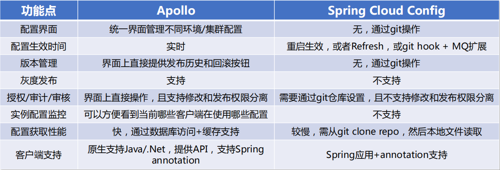
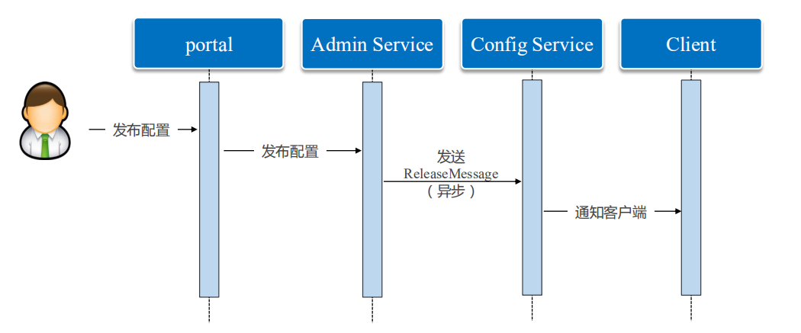
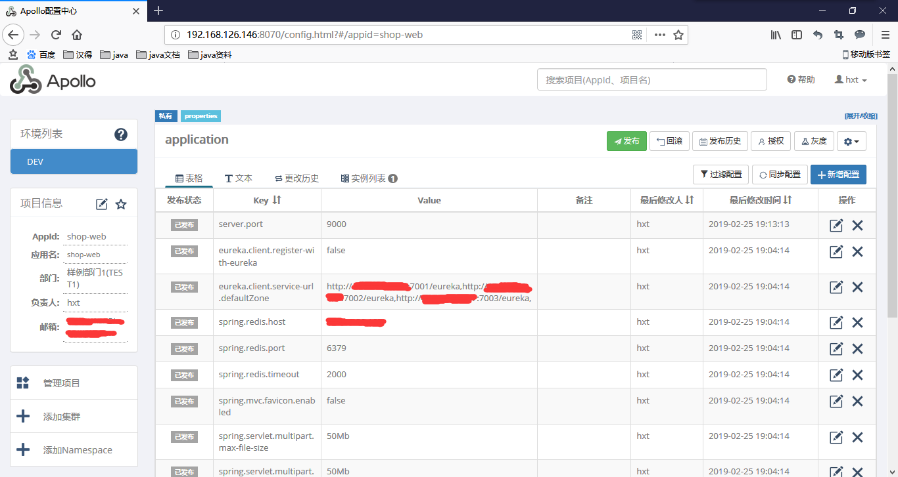
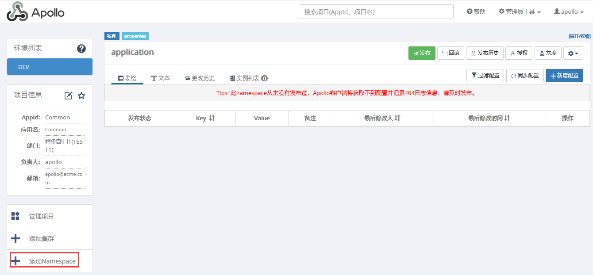
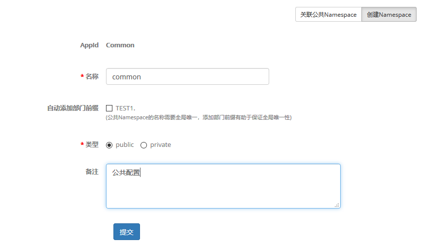
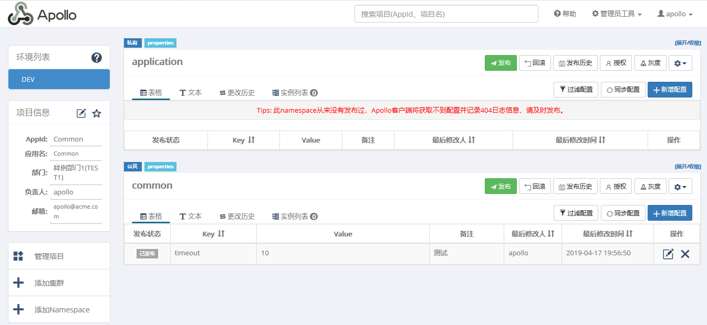
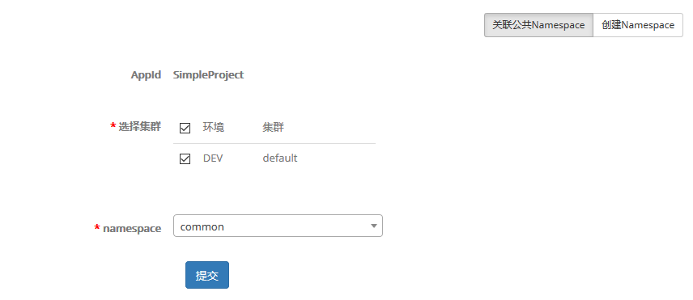
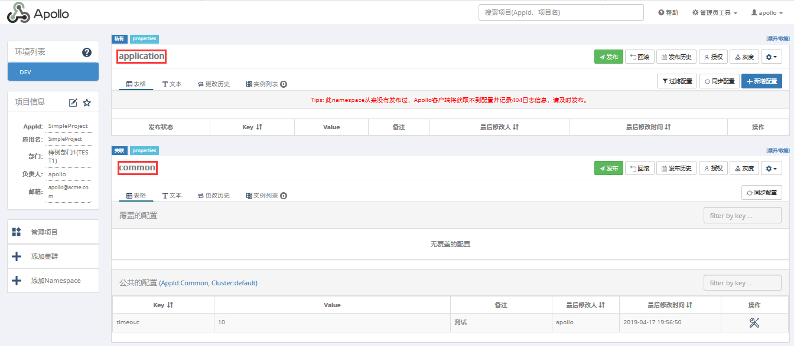

# 一、Apollo分布式配置中心简介

Apollo（阿波罗）是携程的分布式配置中心，能够集中化管理应用不同环境、不同集群的配置，配置修改后能够实时推送到应用端，并且具备规范的权限、流程治理等特性，适用于微服务配置管理场景

Apollo基础模型：

- 用户在配置中心对配置进行修改并发布
- 配置中心通知Apolllo客户端有配置更新
- Apollo客户端从配置中心拉取最新的配置、更新本地配置并通知到应用


Apollo对比Spring Cloud Config：




# 二、修改配置

官方GitHub：https://github.com/ctripcorp/apollo

**1）、从GitHub上源码下载下来**

其中几个比较重要的项目：

- apollo-configservice：提供配置获取接口，提供配置更新推送接口，接口服务对象为Apollo客户端
- apollo-adminservice：提供配置管理接口，提供配置修改、发布等接口，接口服务对象为Portal以及Eureka
- apollo-portal：提供Web界面供用户管理配置
- apollo-client：Apollo提供的客户端程序，为应用提供配置获取、实时更新等功能



配置发布的大致过程：用户在Portal操作配置发布，Portal调用Admin Service的接口操作发布，Admin Service发布配置后，发送ReleaseMessage给各个Config Service，Config Service收到ReleaseMessage后，通知对应的客户端

**2）、数据库初始化**

- ApolloPortalDB：执行apollo-master\scripts\docker-quick-start\sql\apolloportaldb.sql
- ApolloConfigDB：执行apollo-master\scripts\docker-quick-start\sql\apolloconfigdb.sql

**3）、调整配置并打包**

修改apollo-master\scripts中的配置文件build.bat或者build.sh

A.数据库配置

```shell
# apollo config db info
apollo_config_db_url=jdbc:mysql://xxx:3306/ApolloConfigDB?characterEncoding=utf8
apollo_config_db_username=root
apollo_config_db_password=123456

# apollo portal db info
apollo_portal_db_url=jdbc:mysql://xxx:3306/ApolloPortalDB?characterEncoding=utf8
apollo_portal_db_username=root
apollo_portal_db_password=123456
```

B.修改环境调用地址

```shell
# meta server url, different environments should have different meta server addresses
dev_meta=http://localhost:8080
fat_meta=http://localhost:8080
uat_meta=http://localhost:8080
pro_meta=http://localhost:8080
```

C.修改数据库数据

在ApolloConfigDB数据库中,找到表ServerConfig中的eureka.service.url配置项修改为http://192.168.126.146:8080/eureka/

D.编译打包

```
$ ./build.sh
```

该脚本会依次打包apollo-configservice, apollo-adminservice, apollo-portal和apollo-client


# 三、部署

**1）、部署apollo-configservice**

将apollo-master\apollo-configservice\target目录下的apollo-configservice-1.4.0-SNAPSHOT-github.zip上传到服务器解压

修改scripts/startup.sh 

```shell
SERVICE_NAME=apollo-configservice
## Adjust log dir if necessary
LOG_DIR=/shop-apollo/logs
## Adjust server port if necessary
SERVER_PORT=8080
```

**2）、部署apollo-adminservice**

将apollo-master\apollo-adminservice\target目录下的apollo-adminservice-1.4.0-SNAPSHOT-github.zip上传到服务器解压

修改scripts/startup.sh 

```shell
SERVICE_NAME=apollo-adminservice
## Adjust log dir if necessary
LOG_DIR=/shop-apollo/logs
## Adjust server port if necessary
SERVER_PORT=8090
```

**3）、部署apollo-portal**

将apollo-master\apollo-portal\target目录下的apollo-portal-1.4.0-SNAPSHOT-github.zip上传到服务器解压

修改scripts/startup.sh 

```shell
SERVICE_NAME=apollo-portal
## Adjust log dir if necessary
LOG_DIR=/shop-apollo/logs
## Adjust server port if necessary
SERVER_PORT=8070
```

执行scripts目录下的startup.sh启动apollo-configservice、apollo-adminservice和apollo-portal

```
nohup ./startup.sh &
```

启动成功后访问客户端：192.168.126.146:8070

默认用户名密码为：apollo/admin


# 四、SpringBoot整合使用Apollo配置中心

**1）、添加Apollo依赖**

```xml
		<!--apollo相关jar包 -->
		<dependency>
			<groupId>com.ctrip.framework.apollo</groupId>
			<artifactId>apollo-client</artifactId>
			<version>1.1.0</version>
		</dependency>
		<dependency>
			<groupId>com.ctrip.framework.apollo</groupId>
			<artifactId>apollo-core</artifactId>
			<version>1.1.0</version>
		</dependency>
```

**2）、编写application.yml文件**

```yaml
spring:
  application:
    name: shop-web
app:
  id: shop-web
# set apollo meta server address, adjust to actual address if necessary
apollo:
  meta: http://192.168.126.146:8080/

```

**3）、主启动类上使用@EnableApolloConfig注解标注**

```java
//启用Apollo配置中心
@EnableApolloConfig
@SpringBootApplication
@EnableEurekaClient
@EnableFeignClients(basePackages = { "com.hand.shop" })
public class ShopWebApplication {

	public static void main(String[] args) {
		SpringApplication.run(ShopWebApplication.class, args);
	}

}
```
Apollo中的配置信息如下：最重要的是AppId要和application.yml中配置的app.id相对应




# 五、创建Namespace

使用Apollo的过程中如果不同的项目存在相同配置信息，如何把共有的配置信息提取出来共用，使用公共的Namespace可以解决这个问题的，新建公共的Namespace存放公共配置，另一个项目再关联这个Namespace就可以共用配置信息了


**1）、最好新建一个独立的项目用来存储共用配置信息，创建Namespace**

Common项目：




**2）、公共Namespace添加配置信息并发布**

Common项目：



**3）、另一个项目关联这个Namespace来共用配置了**

SimpleProject项目：



提交之后效果如下：



**5）、修改项目中的配置信息**

```yml
app:
  id: SimpleProject
apollo:
  meta: http://192.168.126.147:8080/
  bootstrap:
    enabled: true
    namespaces: application,common
```
项目存在多个Namespace时，需要显示指定apollo.bootstrap.namespaces配置信息，每个Namespace之间用`,`隔开


**Namespace详解：**https://github.com/ctripcorp/apollo/wiki/Apollo%E6%A0%B8%E5%BF%83%E6%A6%82%E5%BF%B5%E4%B9%8B%E2%80%9CNamespace%E2%80%9D

**CSDN地址：**https://blog.csdn.net/qq_40378034/article/details/87925546

